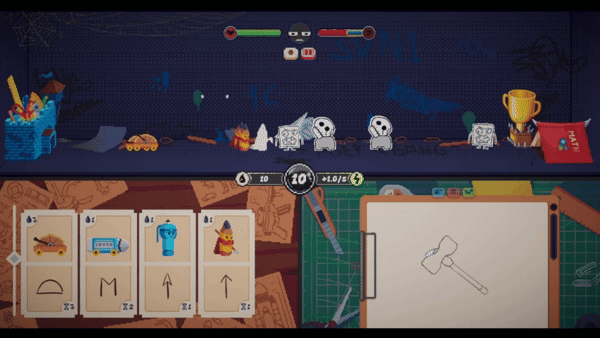
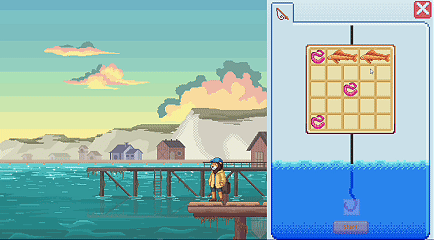
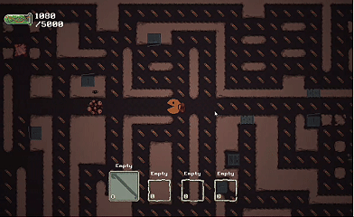
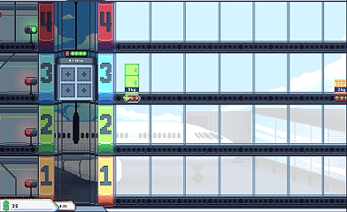
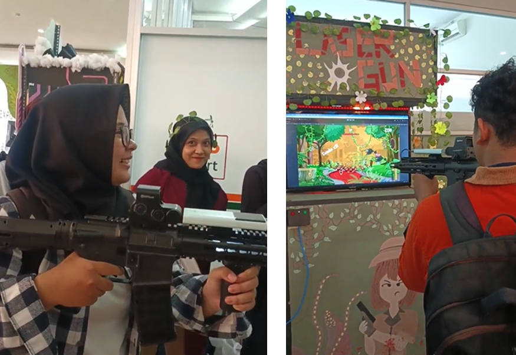

<h1 align="left">Hi, I'm Ahmad Fachri Yamin 👋</h1>
<h3 align="left">Game Programmer | Unity & C#</h3>

<i>"Games are not just about function, but fun."</i>

I am a Game Developer and undergraduate student in Digital Creative Multimedia at Telkom University. I focus on gameplay programming and system architecture using Unity and C#, with additional experience in UI/UX design. I enjoy building clean and maintainable systems that support responsive and engaging player experiences.

---

## 🛠️ Tech Stack & Tools

### 🎮 Game Development

  
  

### 🎨 Design

  

### ⚙️ Tools & Others

  
  

---

## 🎮 Featured Projects & Roles

<table>
  <tr>
    <td width="45%">
      
    </td>
    <td width="55%">
      <h3>☀️ Daydream at 8</h3>
      
⭐ <strong>Best Game Concept Nominee</strong> — Bandung Game Demo Day 2026

      
<strong>Role:</strong> Lead Programmer | GAMESEED 2026

      
<strong>Tech Stack:</strong> Unity 6, C#

      
<strong>Key Implementations:</strong>

      <ul>
        <li>Led core gameplay development for a 2.5D Point & Click, 1D RTS, and Tower Defense game.</li>
        <li>Developed a line-based drawing recognition system that maps player-drawn patterns into deployable units.</li>
        <li>Architected a ScriptableObject-driven unit, combat, and crafting system with unit attributes, ink costs, cooldowns, and combination mechanics.</li>
      </ul>
       
      

        
        
      

    </td>
  </tr>

  <tr>
    <td width="45%">
      
    </td>
    <td width="55%">
      <h3>🎣 Lion On Tuesday</h3>
      
<strong>Role:</strong> Game Programmer Intern | Funix Indonesia

      
<strong>Tech Stack:</strong> Unity 6, C#

      
<strong>Key Implementations:</strong>

      <ul>
        <li>Developed the core fishing simulation and interaction mechanics.</li>
        <li>Built an inventory system for item management and fishing-related interactions.</li>
        <li>Implemented gameplay state management and supporting core systems.</li>
      </ul>
       
      
      
    </td>
  </tr>

  <tr>
    <td width="45%">
      
    </td>
    <td width="55%">
      <h3>👻 Ric-Man 33</h3>
      
🏆 <strong>Overall Winner</strong> — GDGoC UNSRI Game Jam 2026

      
<strong>Role:</strong> Lead Programmer | GDGoC UNSRI Game Jam 2026

      
<strong>Tech Stack:</strong> Unity 6, C#

      
<strong>Key Implementations:</strong>

      <ul>
        <li>Developed a Triple-Threat AI system with line-of-sight detection, audio tracking, and global alert mechanics.</li>
        <li>Implemented tactical counter-item mechanics for different enemy AI behaviors.</li>
        <li>Built a dynamic difficulty system that scales gameplay based on player progression and DNA collection.</li>
      </ul>
       
      

        
        
      

    </td>
  </tr>

  <tr>
    <td width="45%">
      
    </td>
    <td width="55%">
      <h3>📦 Kurir 33</h3>
      
<strong>Role:</strong> Core Game Programmer | GIMJAM 2026

      
⭐ <strong>Best Game Design Nominee</strong> — GIMJAM 2026

      
<strong>Tech Stack:</strong> Unity 6, C#

      
<strong>Key Implementations:</strong>

      <ul>
        <li>Programmed core gameplay mechanics including movement and elevator transition systems.</li>
        <li>Developed item storage, weight calculation, and player health systems.</li>
        <li>Implemented dynamic lighting and visual effects to support the game's atmosphere.</li>
      </ul>
       
      

        
        
      

    </td>
  </tr>

  <tr>
    <td width="45%">
      
    </td>
    <td width="55%">
      <h3>🌲 Jungle Infection</h3>
      
<strong>Role:</strong> Solo Game Programmer & Hardware Integrator | College Project

      
<strong>Tech Stack:</strong> Unity, C#, Hardware Sensors

      
<strong>Key Implementations:</strong>

      <ul>
        <li>Developed all core gameplay mechanics for a PC-based 2D arcade shooter.</li>
        <li>Integrated physical gun hardware with a gyroscope for real-time in-game aiming.</li>
        <li>Programmed hardware input for shooting, reloading, and sensor-based aiming.</li>
      </ul>
    </td>
  </tr>
</table>

---

## 📫 Let's Connect!

* 💼 **LinkedIn:** [ahmad-fachri-yamin](https://www.linkedin.com/in/ahmad-fachri-yamin/)
* 🌐 **Portfolio:** [ahmadfachri.typedream.app](https://ahmadfachri.typedream.app)
* 📧 **Email:** [fahri121yt@gmail.com](mailto:fahri121yt@gmail.com)
